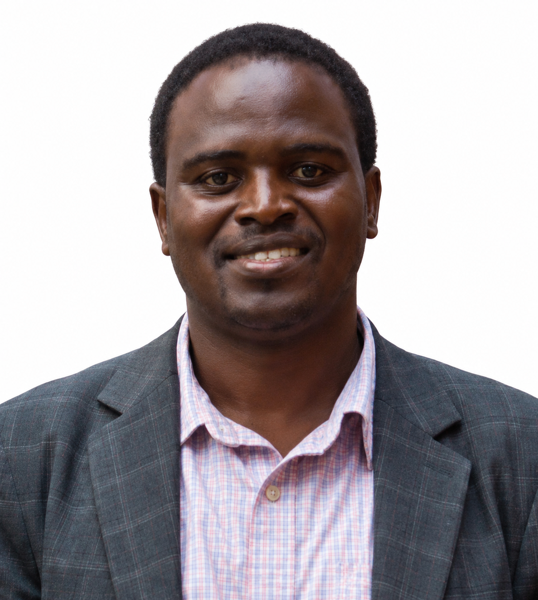
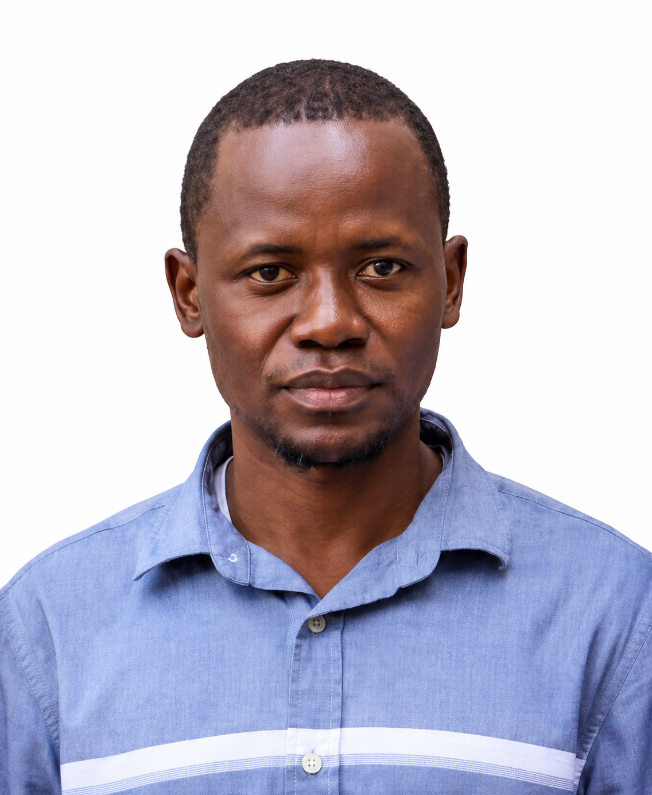

The people who taught, facilitated and coordinated the 2024 edition —
the programme's first cohort.

## Instructors

::: {.card-grid .team-grid}
::: {.card}
{.avatar-photo}

**[Dr. Susan Rumisha](https://www.thekids.org.au/contact-us/our-people/r/susan-rumisha/){target="_blank" rel="noopener noreferrer"}**

Lead of the MAP Dar es Salaam Node, Ifakara Health Institute.
:::

::: {.card}
{.avatar-photo}

**[Dr. Amina Msengwa](https://www.nbs.go.tz/administration/management-team/statistician-general){target="_blank" rel="noopener noreferrer"}**

Statistician General, National Bureau of Statistics, Tanzania.
:::
:::

## Facilitators

::: {.card-grid .team-grid}
::: {.card}
{.avatar-photo}

**[Dr. Aron Wiggins](https://tz.linkedin.com/in/wiggins-aaron-a5507491){target="_blank" rel="noopener noreferrer"}**

Lecturer, University of Dar es Salaam.
:::

::: {.card}
{.avatar-photo}

**[Mr. Bwire Wilson](https://www.linkedin.com/in/bwire-wilson-1789916b/){target="_blank" rel="noopener noreferrer"}**

University of Dar es Salaam.
:::
:::

## Coordinator

::: {.card-grid .team-grid}
::: {.card}
{.avatar-photo}

**[Sosthenes Ketende](https://www.ihi.or.tz/en/our-staff/239/Sosthenes/Charles%2520Ketende/details/){target="_blank" rel="noopener noreferrer"}**

Program Manager, MAP Dar es Salaam Node, Ifakara Health Institute.
:::
:::

---

See the [2024 Edition](../editions/2024.qmd) page for course details,
or browse [other cohorts](index.qmd).
