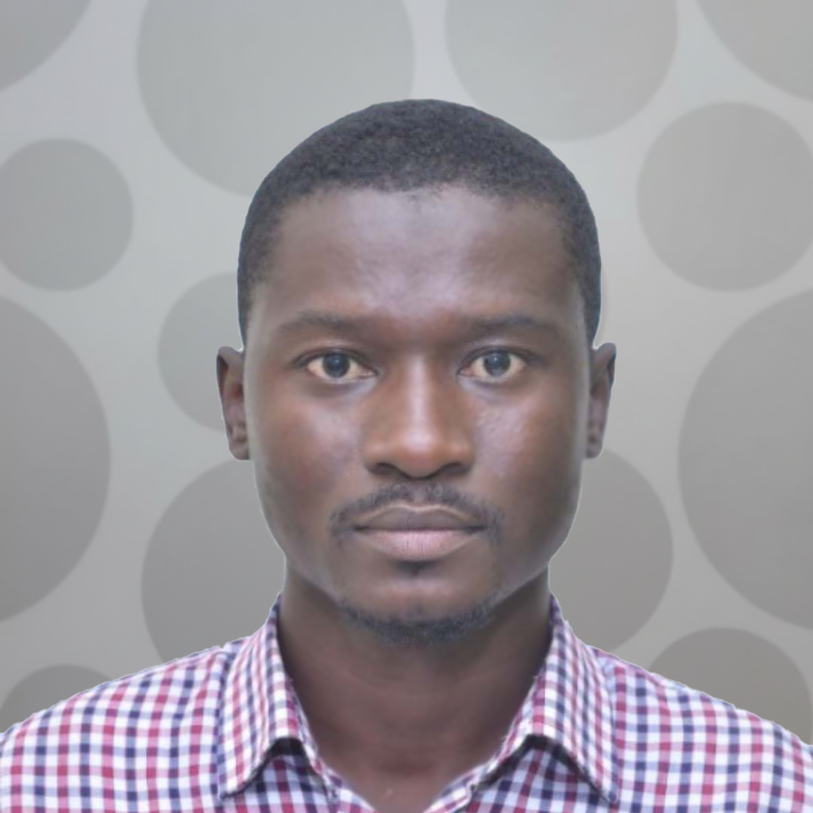
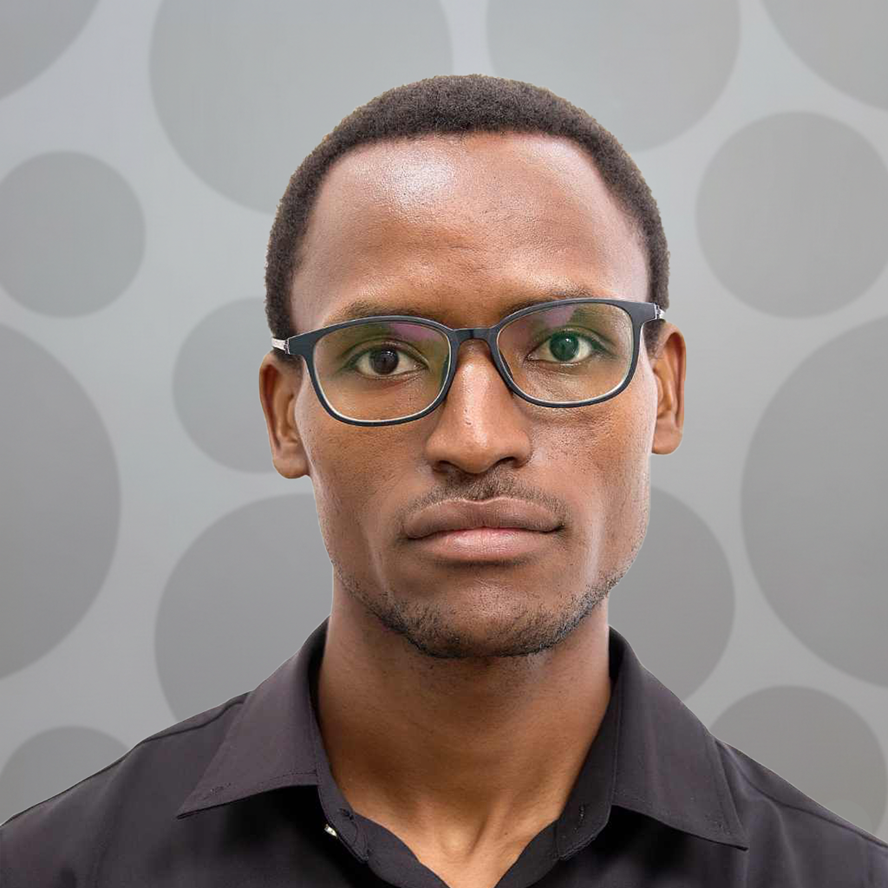

The people teaching, presenting, facilitating and coordinating the
2026 edition of the Geospatial Modelling Workshop.

## Instructors

::: {.card-grid .team-grid}
::: {.card}
{.avatar-photo}

**[Dr. Susan Rumisha](https://www.thekids.org.au/contact-us/our-people/r/susan-rumisha/){target="_blank" rel="noopener noreferrer"}**

Lead of the MAP Dar es Salaam Node, Ifakara Health Institute.
:::

::: {.card}
{.avatar-photo}

**[Prof. Janine Illian](https://uk.linkedin.com/in/janineillian){target="_blank" rel="noopener noreferrer"}**

Chair in Statistical Sciences, University of Glasgow.
:::
:::

## Invited Speakers

::: {.card-grid .team-grid}
::: {.card}
{.avatar-photo}

**[Dr. Amina Msengwa](https://www.nbs.go.tz/administration/management-team/statistician-general){target="_blank" rel="noopener noreferrer"}**

Statistician General, National Bureau of Statistics, Tanzania.
Special seminar 1.
:::

::: {.card}
{.avatar-photo}

**[Dr. Tim Lucas](https://le.ac.uk/people/tim-lucas){target="_blank" rel="noopener noreferrer"}**

Lecturer in Biostatistics, University of Leicester.
Special seminar 2: "Spatial Disaggregation in R".
:::
:::

## Facilitators

::: {.card-grid .team-grid}
::: {.card}
{.avatar-photo}

**[Dr. Ousmane Diao](https://sn.linkedin.com/in/ousmane-diao-391b33100){target="_blank" rel="noopener noreferrer"}**

Senior Research Scientist, MAP Dar es Salaam Node, Ifakara Health Institute.
:::

::: {.card}
{.avatar-photo}

**[Dr. Lembris Njotto](https://www.linkedin.com/in/lembris-njotto-6238b482/){target="_blank" rel="noopener noreferrer"}**

Senior Research Scientist, MAP Dar es Salaam Node, Ifakara Health Institute.
:::

::: {.card}
{.avatar-photo}

**[Yasin Kokoda](https://www.linkedin.com/in/yasini-muhamedi-kokoda-984bb0247/){target="_blank" rel="noopener noreferrer"}**

Research Scientist, MAP Dar es Salaam Node, Ifakara Health Institute.
:::
:::

## Coordinators

::: {.card-grid .team-grid}
::: {.card}
{.avatar-photo}

**[Dr. Punam Amratia](https://www.thekids.org.au/contact-us/our-people/a/punam-amratia/){target="_blank" rel="noopener noreferrer"}**

Technical Lead, MAP Dar es Salaam Node, Ifakara Health Institute.
:::

::: {.card}
{.avatar-photo}

**[Sosthenes Ketende](https://www.ihi.or.tz/en/our-staff/239/Sosthenes/Charles%2520Ketende/details/){target="_blank" rel="noopener noreferrer"}**

Program Manager, MAP Dar es Salaam Node, Ifakara Health Institute.
:::

::: {.card}
{.avatar-photo}

**[Christine Myalla](https://www.linkedin.com/in/christinamyalla/){target="_blank" rel="noopener noreferrer"}**

Data Engineer Lead, MAP Dar es Salaam Node, Ifakara Health Institute.
:::
:::

---

See the [2026 Edition](../editions/2026.qmd) page for course details,
or browse [other cohorts](index.qmd).
