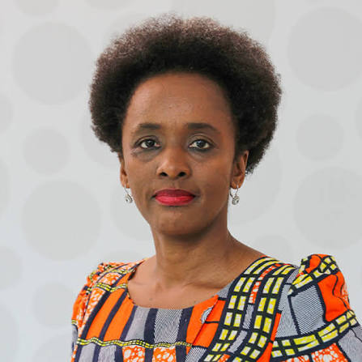
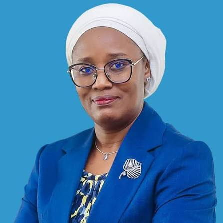
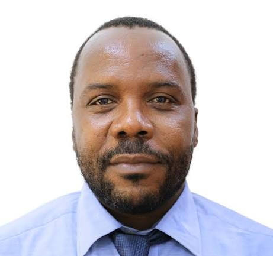

## Key Facilitators

::: {.card-grid .team-grid}
::: {.card}
{.avatar-photo}

**[Dr. Susan Rumisha](https://www.thekids.org.au/contact-us/our-people/r/susan-rumisha/){target="_blank" rel="noopener noreferrer"}**

Lead of the MAP Dar es Salaam Node, Ifakara Health Institute.
:::

::: {.card}
{.avatar-photo}

**[Dr. Punam Amratia](https://www.thekids.org.au/contact-us/our-people/a/punam-amratia/){target="_blank" rel="noopener noreferrer"}**

Technical Lead of the MAP Dar es Salaam Node, Ifakara Health
Institute.
:::

::: {.card}
{.avatar-photo}

**[Dr. Amina Msengwa](https://www.nbs.go.tz/administration/management-team/statistician-general){target="_blank" rel="noopener noreferrer"}**

Statistician General, National Bureau of Statistics, Tanzania.
:::
:::

## Coordinators

::: {.card-grid .team-grid}
::: {.card}
{.avatar-photo}

**[Christine Myalla](https://www.linkedin.com/in/christinamyalla/){target="_blank" rel="noopener noreferrer"}**

Data Engineer Lead of the MAP Dar es Salaam Node, Ifakara Health
Institute.
:::

::: {.card}
{.avatar-photo}

**[Sosthenes Ketende](https://www.ihi.or.tz/en/our-staff/239/Sosthenes/Charles%2520Ketende/details/){target="_blank" rel="noopener noreferrer"}**

Program Manager of the MAP Dar es Salaam Node, Ifakara Health
Institute.
:::
:::

## Invited Speakers & Helpers

### 2026

- Janine Illian — Invited Speaker, "The Data Behind the Decisions:
  National Statistical Offices as Partners in Public Health"
  (presented with NBS)
- Tim Lucas — Invited Speaker, "Spatial Disaggregation in R"

### 2025

- Prof. Nick Golding — Invited Speaker, Special Lecture: Understanding
  Generalized Linear Models
- Dr. Aron Wiggins — Helper, University of Dar es Salaam
- Mr. Bwire Wilson — Helper, University of Dar es Salaam

### 2024

- Dr. Aron Wiggins — Helper, University of Dar es Salaam
- Mr. Bwire Wilson — Helper, University of Dar es Salaam
