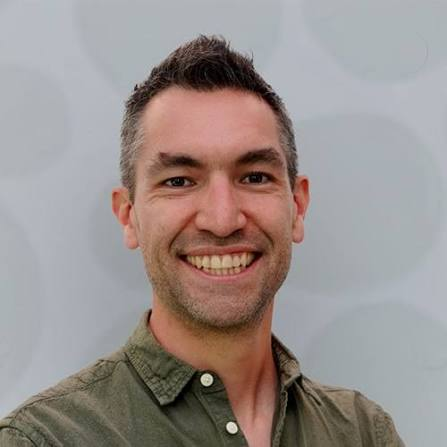

## Instructors

### 2026
::: {.card-grid .team-grid}
::: {.card}
{.avatar-photo}

**[Prof. Janine Illian](https://www.gla.ac.uk/schools/mathematicsstatistics/staff/janineillian/){target="_blank" rel="noopener noreferrer"}**

Chair in Statistical Sciences at the University of Glasgow, and author
of the leading textbook on spatial point process modelling.
:::

::: {.card}
{.avatar-photo}

**[Dr. Tim Lucas](https://le.ac.uk/people/tim-lucas){target="_blank" rel="noopener noreferrer"}**

Lecturer in biostatistics specializing in geospatial models, machine
learning, and disaggregation regression to predict disease patterns
from observational data.
:::

::: {.card}
{.avatar-photo}

**[Dr. Amina Msengwa](https://www.nbs.go.tz/administration/management-team/statistician-general){target="_blank" rel="noopener noreferrer"}**

Statistician General, National Bureau of Statistics, Tanzania.
:::

::: {.card}
{.avatar-photo}

**[Dr. Susan Rumisha](https://www.thekids.org.au/contact-us/our-people/r/susan-rumisha/){target="_blank" rel="noopener noreferrer"}**

Lead of the MAP Dar es Salaam Node, Ifakara Health Institute.
:::
:::

## Coordinators

::: {.card-grid .team-grid}
::: {.card}
{.avatar-photo}

**[Dr. Punam Amratia](https://www.thekids.org.au/contact-us/our-people/a/punam-amratia/){target="_blank" rel="noopener noreferrer"}**

Technical Lead of the MAP Dar es Salaam Node, Ifakara Health
Institute.
:::

::: {.card}
{.avatar-photo}

**[Sosthenes Ketende](https://www.ihi.or.tz/en/our-staff/239/Sosthenes/Charles%2520Ketende/details/){target="_blank" rel="noopener noreferrer"}**

Program Manager of the MAP Dar es Salaam Node, Ifakara Health
Institute.
:::

::: {.card}
{.avatar-photo}

**[Christine Myalla](https://www.linkedin.com/in/christinamyalla/){target="_blank" rel="noopener noreferrer"}**

Data Engineer Lead of the MAP Dar es Salaam Node, Ifakara Health
Institute.
:::
:::

## Invited Speakers & Facilitators

### 2025

::: {.card-grid .team-grid}
::: {.card}
{.avatar-photo}

**[Prof. Nick Golding](https://www.thekids.org.au/contact-us/our-people/g/nick-golding/){target="_blank" rel="noopener noreferrer"}**

Invited Speaker, Special Lecture: Understanding Generalized Linear
Models
:::

::: {.card}
{.avatar-photo}

**[Dr. Punam Amratia](https://www.thekids.org.au/contact-us/our-people/a/punam-amratia/){target="_blank" rel="noopener noreferrer"}**

Invited Speaker
:::
:::

- Dr. Aron Wiggins — Facilitator, University of Dar es Salaam
- Mr. Bwire Wilson — Facilitator, University of Dar es Salaam

### 2024

- Dr. Aron Wiggins — Facilitator, University of Dar es Salaam
- Mr. Bwire Wilson — Facilitator, University of Dar es Salaam
