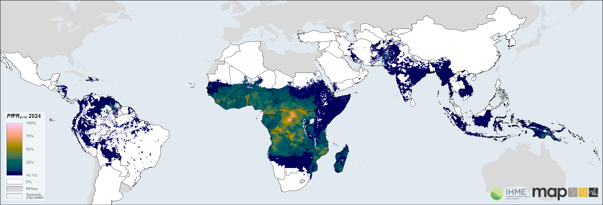

::: {.lp}

<!-- ============ HERO ============ -->
<section class="hero">
  

    

      Annual Training Programme
      <h1 class="hero-title">Geospatial modelling for public health applications</h1>
      

        An intensive training programme for statisticians and public health
        professionals in <strong>R programming</strong>, <strong>spatial data
        analysis</strong>, <strong>Bayesian geostatistical modelling</strong>,
        and <strong>applied health data science</strong>.
      

      

        <a class="btn btn-primary btn-lg px-4" href="https://geomap-onboardnig-portal-frontend.vercel.app/index.html" target="_blank" rel="noopener noreferrer">
          Apply Now <i class="bi bi-arrow-right ms-1"></i>
        </a>
        <a class="btn btn-outline-secondary btn-lg px-4" href="#how-it-works">
          Learn more
        </a>
      

      

        <i class="bi bi-clock me-1"></i> Applications open now for the next cohort
      

    

  

</section>

<!-- ============ HOW IT WORKS ============ -->
<section class="section-white" id="how-it-works">
  

    

      How it works
      <h2>Three phases from application to lasting impact</h2>
      
A structured pathway from selection through training to skills you keep building on afterwards.

    

    

      

        

          
<i class="bi bi-file-earmark-text-fill"></i>

          <h5>1. Apply</h5>
          

            Submit your details, take a short knowledge check, and complete
            your application with a CV and motivation statement.
          

        

      

      

        

          
<i class="bi bi-mortarboard-fill"></i>

          <h5>2. Train</h5>
          

            Selected participants join an intensive workshop with hands-on
            practicals in R, INLA and Bayesian geostatistics — taught by
            MAP scientists.
          

        

      

      

        

          
<i class="bi bi-graph-up-arrow"></i>

          <h5>3. Apply the skills</h5>
          

            Take modern geospatial methods back to your own research —
            alumni have gone on to publish papers building on skills
            learned in the programme.
          

        

      

    

  

</section>

<!-- ============ ABOUT THE PROGRAMME ============ -->
<section class="section-tint" id="about">
  

    

      

        About the programme
        <h2>Taught by the scientists producing WHO's malaria estimates.</h2>
        

          Run by the <strong>MAP Project team</strong>, this programme brings
          together researchers, students and practitioners to strengthen
          skills in <strong>Bayesian geostatistical modelling</strong> for
          real-world public-health applications.
        

        

          MAP is a designated <strong>WHO Collaborating Centre in Geospatial
          Disease Modelling</strong>. You'll learn the exact methods used to
          inform the World Malaria Report and the Global Burden of Disease
          study — from the people producing that work.
        

      

      

        

          

            <i class="bi bi-code-slash"></i>
            

              <strong>R programming</strong>
              Data wrangling, visualization, and reproducible workflows.
            

          

          

            <i class="bi bi-globe-americas"></i>
            

              <strong>Spatial data</strong>
              Vector &amp; raster analysis with <code>sf</code>, <code>terra</code> and friends.
            

          

          

            <i class="bi bi-graph-up"></i>
            

              <strong>Bayesian modelling</strong>
              Geostatistical models with INLA and INLAbru.
            

          

          

            <i class="bi bi-heart-pulse"></i>
            

              <strong>Applied health data</strong>
              Real-world epidemiology and public-health analytics.
            

          

        

      

    

  

</section>

<!-- ============ IMPACT MAP ============ -->
<section class="section-white" id="impact">
  

    

      From data to decisions
      <h2>Modelled malaria risk across Africa</h2>
      

        Every cohort works with real spatial data. The same Bayesian
        geostatistical methods taught in the programme are what produce
        risk surfaces like this one.
      

    

    <figure class="impact-figure">
      
      <figcaption>Modelled malaria risk estimates across Africa, produced with the geostatistical methods taught in the programme.</figcaption>
    </figure>
  

</section>

<!-- ============ CTA STRIP ============ -->
<section class="cta-strip">
  

    <h3 class="mb-2">Ready to apply?</h3>
    

      Applications are now open for the next cohort. Review the details,
      then submit through the portal.
    

    <a class="btn btn-light btn-lg px-4" href="https://geomap-onboardnig-portal-frontend.vercel.app/index.html" target="_blank" rel="noopener noreferrer">
      Apply Now <i class="bi bi-arrow-right ms-1"></i>
    </a>
  

</section>

<!-- ============ PARTNERS ============ -->
<section class="section-white partners-section">
  

    

      
In Partnership With

      

        
        
        
        
      

    

  

</section>

:::
