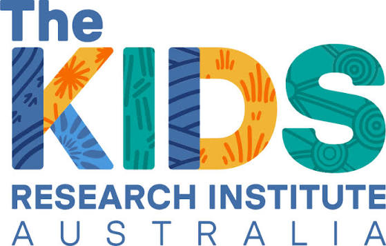
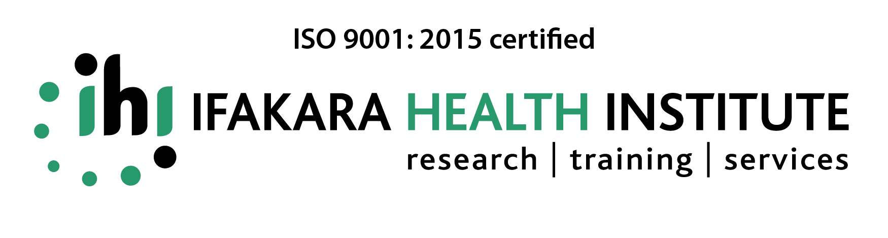
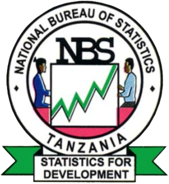
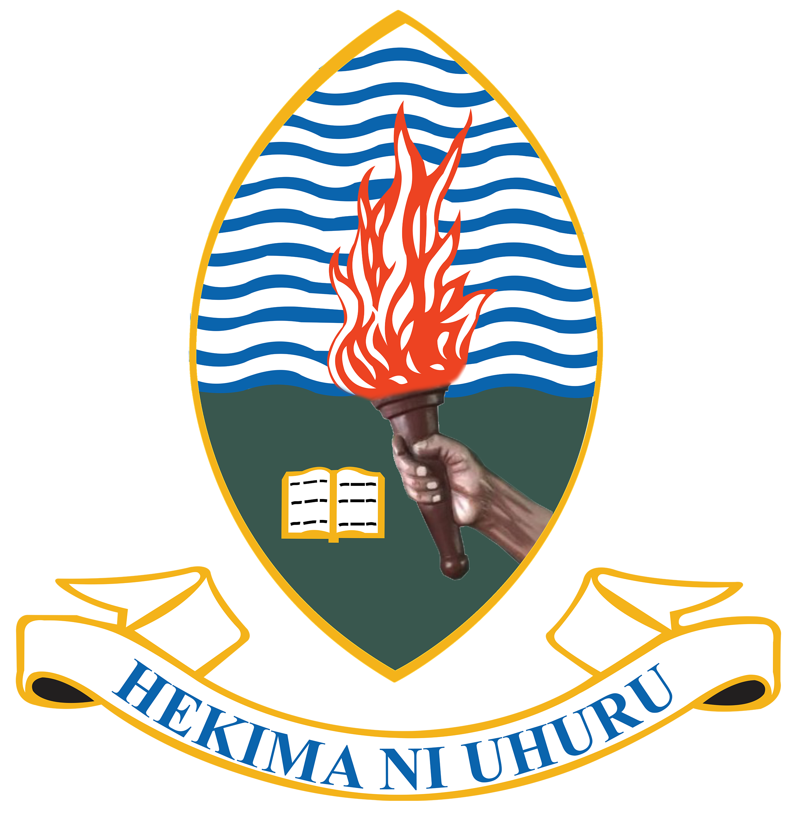

::: {.hero}
The Geospatial Modelling Workshop is an intensive training programme for
statisticians and public health professionals looking to build their
skills in geospatial analysis and modelling. Drawing on real-life
examples from malaria research, the programme guides participants from
foundational spatial data concepts through to Bayesian geostatistical
modelling — equipping them with skills they can continue to build on
long after the training ends.

The workshop is run annually, bringing together leading researchers and
practitioners from across the region.
:::

::: {.stats-band}
::: {.stat}
**3**

Cohorts Delivered
:::

::: {.stat}
**400+**

Applicants to Date
:::

::: {.stat}
**~30**

Selected per Cohort (avg)
:::

::: {.stat}
**7+**

Countries Represented
:::
:::

## From Data to Decisions

::: {.impact-section}
::: {.impact-map}

:::

::: {.impact-text}
Every cohort works with real malaria and public health data, using the same
Bayesian geostatistical methods taught in the programme to produce modelled
risk surfaces like the one shown here — moving from raw spatial data to
maps that inform decisions.

[Learn more about the Programme →](programme/index.qmd)
:::
:::

## What You'll Gain

::: {.card-grid .gain-grid}
::: {.card}
<i class="bi bi-easel card-icon" aria-hidden="true"></i>

**Expert-Led Training**

Hands-on training in advanced statistical models, taught by leading
experts in geospatial modelling and public health.
:::

::: {.card}
<i class="bi bi-graph-up card-icon" aria-hidden="true"></i>

**Modern Methods**

Learn current geospatial modelling methods — including Bayesian
geostatistical approaches (e.g. INLA, INLAbru) — from practitioners
actively using them in real malaria and public health research.
:::

::: {.card}
<i class="bi bi-database card-icon" aria-hidden="true"></i>

**Real-World Data**

Work with real spatial and public health datasets, moving from raw
data to models that inform decisions.
:::

::: {.card}
<i class="bi bi-diagram-3 card-icon" aria-hidden="true"></i>

**Regional Network**

Join a growing regional network of geospatial modellers across
Sub-Saharan Africa.
:::

::: {.card}
<i class="bi bi-patch-check card-icon" aria-hidden="true"></i>

**Certification**

Certificate of completion awarded to all participants.
:::
:::

## Ready to Apply?

Review the eligibility criteria and application details on the Call for
Applications page.

[Apply Now →](https://spaat-onboardnig-portal-frontend.vercel.app/){.btn target="_blank" rel="noopener noreferrer"}

::: {.partner-strip}
In Partnership With

:::
